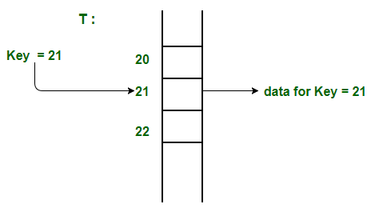

# Hashing

Hashing is a technique or process of mapping keys, and values into the hash table by using a hash function

```
Hashing is an improvement over Direct Access Table. The idea is to use a hash function that converts a given phone number or any other key to a smaller number and uses the small number as an index in a table called a hash table.
```

**Hash Function**

Hashing is a technique or process of mapping keys, and values into the hash table by using a hash function. 

**Hash Table**

Hash Table is a data structure which stores data in an associative manner. In a hash table, data is stored in an array format, where each data value has its own unique index value.

The mod method: 

- In this method for creating hash functions, we map a key into one of the slots of table by taking the remainder of key divided by table_size. That is, the hash function is 
 
```h(key) = key mod table_size ```

The multiplication method: 

- In multiplication method, we multiply the key k by a constant real number c in the range 0 < c < 1 and extract the fractional part of k * c.

- Then we multiply this value by table_size m and take the floor of the result. It can be represented as

```
h(k) = floor (m * (k * c mod 1))
                or
h(k) = floor (m * frac (k * c))
```


Direct Address Table

In direct address tables, records are placed using their key values directly as indexes.



 Advantages:

- Searching in O(1) Time: Direct address tables use arrays which are random access data structure, so, the key values (which are also the index of the array) can be easily used to search the records in O(1) time.

- Insertion in O(1) Time: We can easily insert an element in an array in O(1) time. The same thing follows in a direct address table also.

- Deletion in O(1) Time: Deletion of an element takes O(1) time in an array. Similarly, to delete an element in a direct address table we need O(1) time.
 
Limitations:

- Prior knowledge of maximum key value

-Practically useful only if the maximum value is very less.

- It causes wastage of memory space if there is a significant difference between total records and maximum value.

``Hashing can overcome these limitations of direct address tables. ``

**Collision Handling**

Collision Handling: Since a hash function gets us a small number for a big key, there is possibility that two keys result in same value. The situation where a newly inserted key maps to an already occupied slot in hash table is called collision

**Chaining**

Chaining:The idea is to make each cell of hash table point to a linked list of records that have same hash function value

Separate Chaining:

- The idea behind separate chaining is to implement the array as a linked list called a chain.


```
// CPP program to implement hashing with chaining
#include<bits/stdc++.h>
using namespace std;
 
class Hash
{
    int BUCKET;    // No. of buckets
 
    // Pointer to an array containing buckets
    list<int> *table;
public:
    Hash(int V);  // Constructor
 
    // inserts a key into hash table
    void insertItem(int x);
 
    // deletes a key from hash table
    void deleteItem(int key);
 
    // hash function to map values to key
    int hashFunction(int x) {
        return (x % BUCKET);
    }
 
    void displayHash();
};
 
Hash::Hash(int b)
{
    this->BUCKET = b;
    table = new list<int>[BUCKET];
}
 
void Hash::insertItem(int key)
{
    int index = hashFunction(key);
    table[index].push_back(key); 
}
 
void Hash::deleteItem(int key)
{
  // get the hash index of key
  int index = hashFunction(key);
 
  // find the key in (index)th list
  list <int> :: iterator i;
  for (i = table[index].begin();
           i != table[index].end(); i++) {
    if (*i == key)
      break;
  }
 
  // if key is found in hash table, remove it
  if (i != table[index].end())
    table[index].erase(i);
}
 
// function to display hash table
void Hash::displayHash() {
  for (int i = 0; i < BUCKET; i++) {
    cout << i;
    for (auto x : table[i])
      cout << " --> " << x;
    cout << endl;
  }
}
 
// Driver program 
int main()
{
  // array that contains keys to be mapped
  int a[] = {15, 11, 27, 8, 12};
  int n = sizeof(a)/sizeof(a[0]);
 
  // insert the keys into the hash table
  Hash h(7);   // 7 is count of buckets in
               // hash table
  for (int i = 0; i < n; i++) 
    h.insertItem(a[i]);  
 
  // delete 12 from hash table
  h.deleteItem(12);
 
  // display the Hash table
  h.displayHash();
 
  return 0;
}
```
**Open Addressing:**

In Open Addressing, all elements are stored in the hash table itself. So at any point, the size of the table must be greater than or equal to the total number of keys

- Insert(k): Keep probing until an empty slot is found. Once an empty slot is found, insert k. 

- Search(k): Keep probing until the slot’s key doesn’t become equal to k or an empty slot is reached. 

- Delete(k): Delete operation is interesting. If we simply delete a key, then the search may fail. So slots of deleted keys are marked specially as “deleted”. 

The insert can insert an item in a deleted slot, but the search doesn’t stop at a deleted slot.

1.  Linear Probing: 

In linear probing, the hash table is searched sequentially that starts from the original location of the hash. If in case the location that we get is already occupied, then we check for the next location. 

```
The function used for rehashing is as follows: rehash(key) = (n+1)%table-size. 
```


Challenges in Linear Probing :

- Primary Clustering: One of the problems with linear probing is Primary clustering, many consecutive elements form groups and it starts taking time to find a free slot or to search for an element. 


- Secondary Clustering: Secondary clustering is less severe, two records only have the same collision chain (Probe Sequence) if their initial position is the same.

**Quadratic probing**

Quadratic probing is a method with the help of which we can solve the problem of clustering. This method is also known as the mid-square method. In this method, we look for the i2‘th slot in the ith iteration. We always start from the original hash location. If only the location is occupied then we check the other slots.

```
let hash(x) be the slot index computed using hash function.  

If slot hash(x) % S is full, then we try (hash(x) + 1*1) % S
If (hash(x) + 1*1) % S is also full, then we try (hash(x) + 2*2) % S
If (hash(x) + 2*2) % S is also full, then we try (hash(x) + 3*3) % S
…………………………………………..
…………………………………………..
```

**Double hashing**

Double hashing is a technique that reduces clustering in an optimized way. In this technique, the increments for the probing sequence are computed by using another hash function. We use another hash function hash2(x) and look for the i*hash2(x) slot in the ith rotation. 

```
let hash(x) be the slot index computed using hash function.  

If slot hash(x) % S is full, then we try (hash(x) + 1*hash2(x)) % S
If (hash(x) + 1*hash2(x)) % S is also full, then we try (hash(x) + 2*hash2(x)) % S
If (hash(x) + 2*hash2(x)) % S is also full, then we try (hash(x) + 3*hash2(x)) % S
…………………………………………..
…………………………………………..

```


